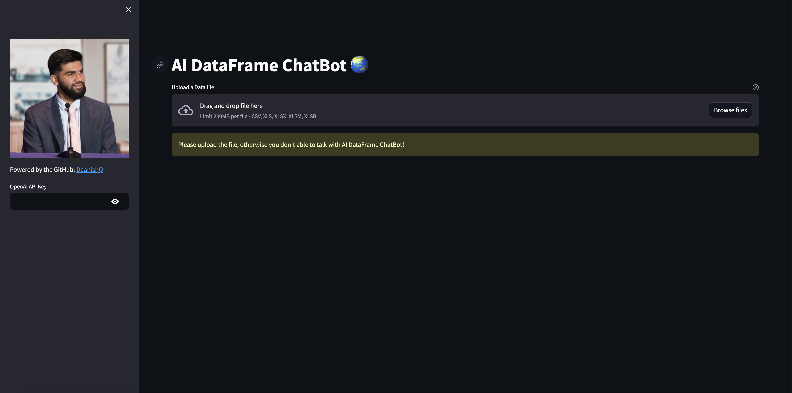

# AI DataFrame ChatBot 🌏

## Overview

This repository contains code for an AI-powered chatbot designed to interact with dataframes. It utilizes Streamlit for the user interface and OpenAI's GPT-3.5 Turbo model for natural language processing.

## Features

- **Upload Data:** Users can upload various types of data files such as CSV, Excel, etc.
- **Natural Language Interface:** The chatbot understands natural language queries about the uploaded data.
- **Real-time Responses:** Responses from the chatbot are generated in real-time.
- **Clear Conversation History:** Users have the option to clear the conversation history.

## Installation

1. Clone this repository:

```bash
git clone https://github.com/DaanishQ/AI-DataFrame-ChatBot.git
```

2. Install dependencies:

```bash
pip install -r requirements.txt
```

## Usage

1. Run the Streamlit app:

```bash
streamlit run "AI DataFrame ChatBot.py"
```

2. Upload a data file.
3. Interact with the chatbot by typing queries or questions about the data.

## Screenshots



## Contributors

- [DaanishQ](https://github.com/DaanishQ) - Creator and Maintainer

## License

This project is licensed under the MIT License - see the [LICENSE](LICENSE) file for details.